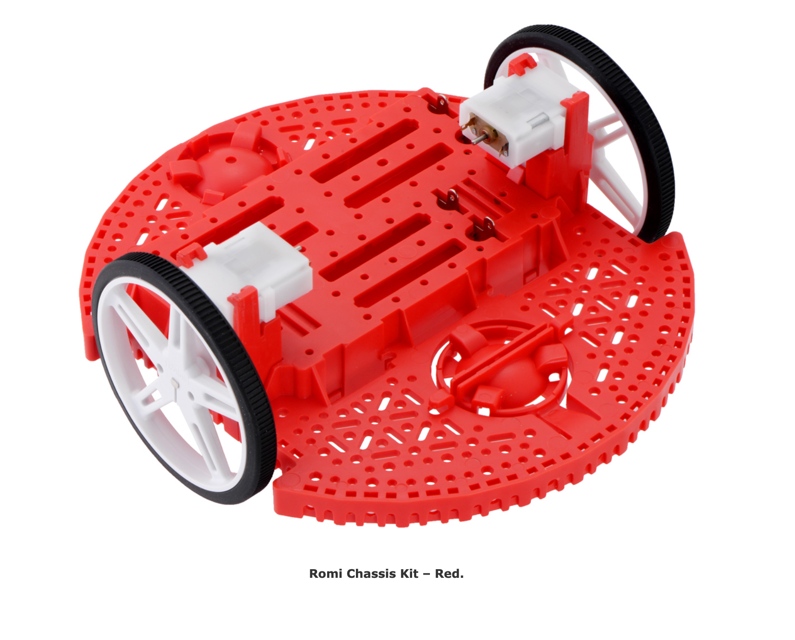
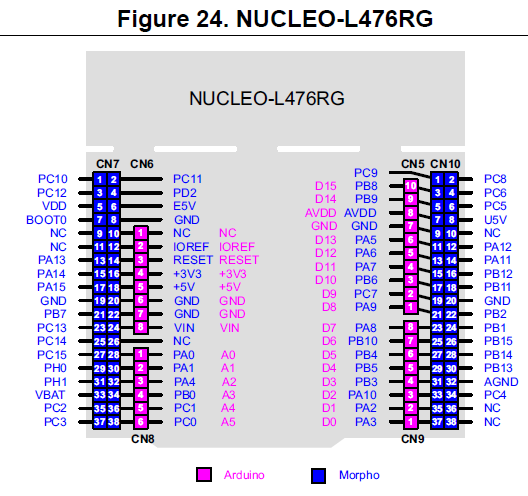
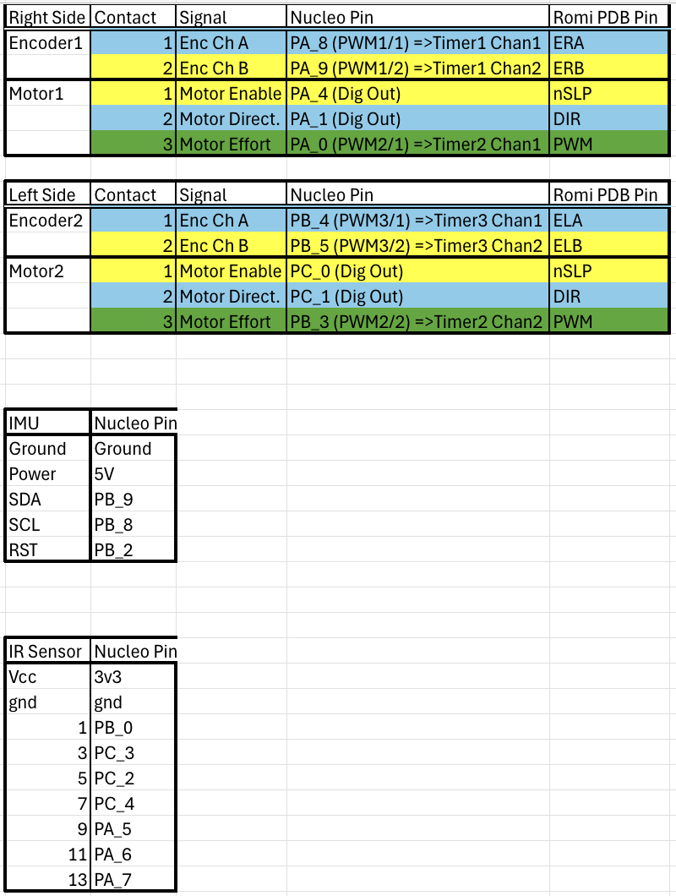

Hardware
============

Chasis
------

We are using the Pololu Romi chassis with the corresponding Motor Driver and Power Distribution Board for the Romi Chassis. The robot runs off 6 AA rechargable NiMH batteries.

   Romi Chassis

Processor
---------

The brain of the robot is the Nucleo-L476RG, running a custom blend of micropython with modules from (https://github.com/spluttflob/ME405-Support/). The board sits on top of a ShoeOfBrian03C board.

Sensors
-------

Our Romi robot is equipped with:

1.) A 7 segment Infrared Sensor that we have attached to the front of the Romi chassis. It is seated below the chassis via a 3D printed offset to position the sensors at an optimal height from the track to allow them to read the black lines vs white background accurately.

2.) A bump sensor attached to the front of the Romi chassis. It is wired in parallel such that any switch depression activates the bump "signal".

Pinout
------

From the Nucleo-L476RG official documentation, this image details the pin labels.

This is the pinout which we used on our Romi.

