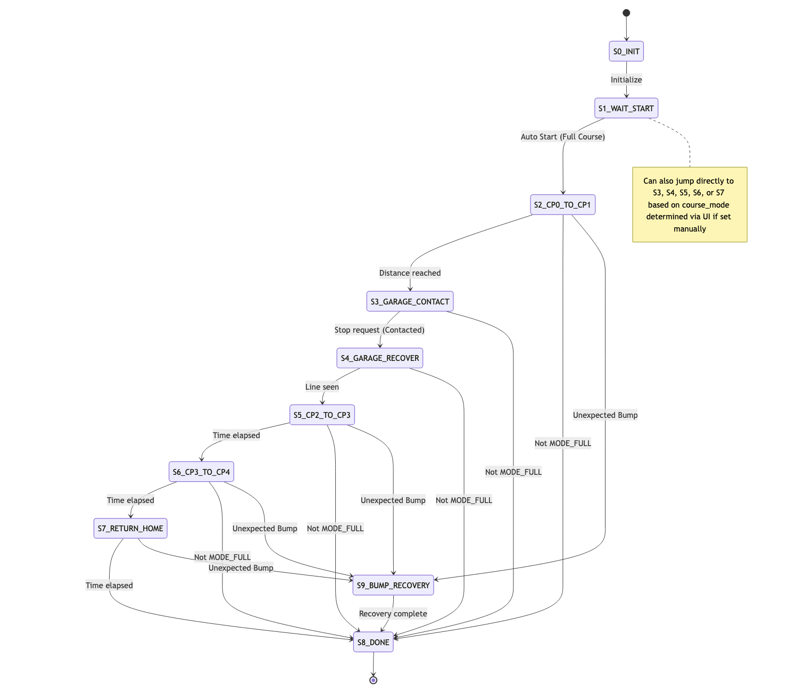
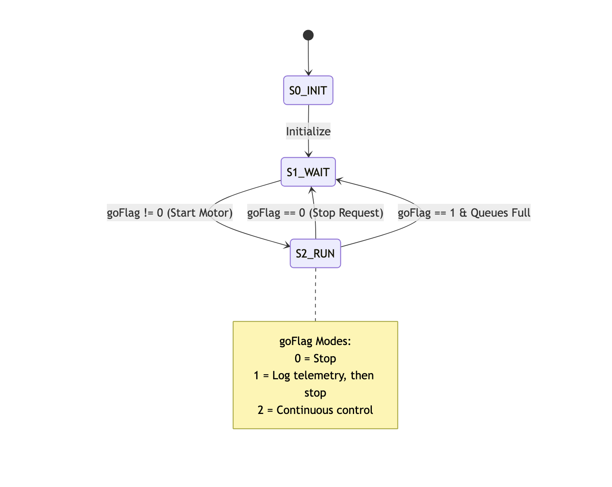

Tasks
=====

The course FSM details the logic behind the course navigation.

The motor FSM details general motor logic for controlling motor stop/go.

Below are all the tasks and drivers for Romi:

.. toctree::
   :maxdepth: 1

   Main Program <api_main>
   Motor Driver <api_motor_driver>
   Encoder Driver <api_encoder>
   Shared Task Data <api_task_share>
   Cooperative Tasking <api_cotask>
   Motor Task <api_task_motor>
   User Task <api_task_user>
   Line Sensor Driver <api_line_sensor_driver>
   Line Sensor Task <api_line_sensor>
   Line Follow Task <api_line_follow>
   Bumper Task <api_bumper_task>
   Bumper Driver <api_bumper_driver>
   Course Task <api_task_course>
